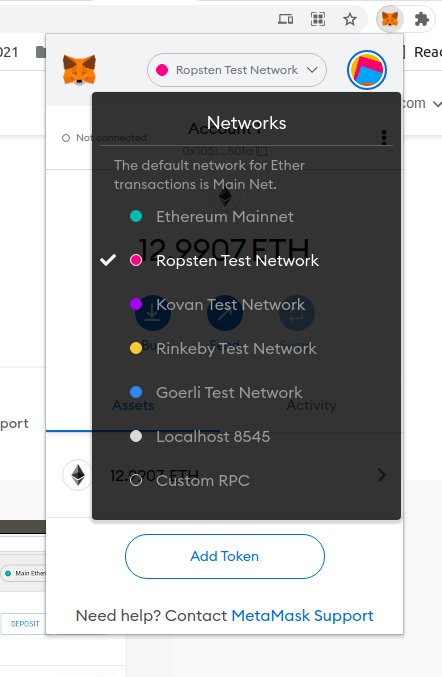
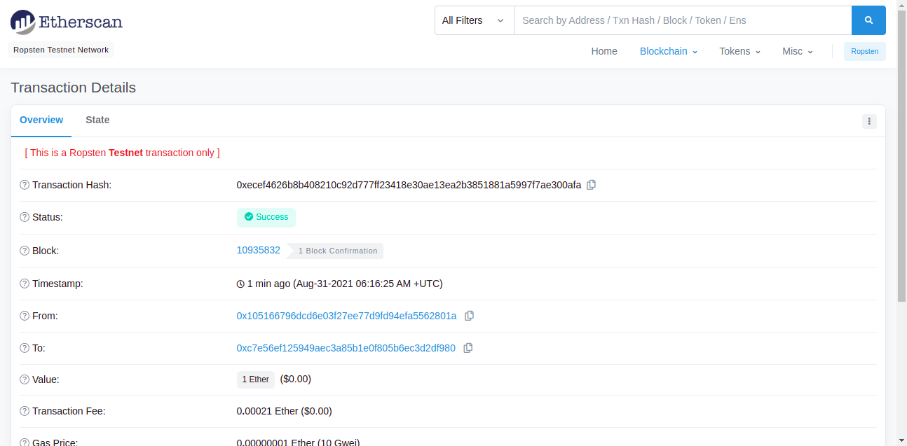

# Step 25: Send Signed Transaction

## References:

1.  We will follow the latter part of this [video tutorial](https://www.youtube.com/watch?v=uFdjZ-B3GCM&list=PLS5SEs8ZftgXlCGXNfzKdq7nGBcIaVOdN&index=3) in this step.

## Step 1

Create `packacge.json`, `tsconfig.json` and `tslint.json` files as in [Step21](../step21_web3_node_getbalance). Also, install the same dependencies, and add the same scripts in `package.json`.

Add `ethereumjs-tx` for signing the transactions and `dotenv` for working with environment variables.

```bash
npm i ethereumjs-tx
npm i -D dotenv
```

## Step 2

Download MetaMask wallet (for Chrome use this [extension](https://chrome.google.com/webstore/detail/metamask/nkbihfbeogaeaoehlefnkodbefgpgknn)) and create two accounts in the wallet (one account will be created automatically when first creating the wallet). Get some fake ETH from a faucet for one of your accounts. Following are some of the faucets available on Ropsten Public Test Network:

1.  [Ropsten Ethereum (rETH) Faucet](https://faucet.dimensions.network/)
2.  [Throttled Testnet Faucet](https://ipfs.io/ipfs/QmVAwVKys271P5EQyEfVSxm7BJDKWt42A2gHvNmxLjZMps/)
3.  [Ropsten Ethereum Faucet](https://faucet.ropsten.be/)

Connect your MetaMask wallet to Ropsten Test Network (as in the following figure) to check if you have received ETH.

<p align="center">
  
</p>

## Step 3

Create a `.env` file and save some environment variables in it in the format given in `.env.example`.

```
ACCOUNT1_PUBLIC_ADDRESS = REPLACE_WITH_YOUR_ACCOUNT_1_PUBLIC_ADDRESS
ACCOUNT2_PUBLIC_ADDRESS = REPLACE_WITH_YOUR_ACCOUNT_2_PUBLIC_ADDRESS

ACCOUNT1_PRIVATE_KEY = REPLACE_WITH_YOUR_ACCOUNT_1_PRIVATE_KEY
ACCOUNT2_PRIVATE_KEY = REPLACE_WITH_YOUR_ACCOUNT_2_PRIVATE_KEY
```

## Step 4

Create `EthereumAccount.ts` and `index.ts` files. In `EthereumAccount.ts`, replace INFURA_PROJECT_ID with your Infura project ID.

```ts
// Ropsten Test Network endpoint.
const network = "ropsten";
const INFURA_PROJECT_ID = "INFURA_PROJECT_ID";
const RPC_ENDPOINT = `https://${network}.infura.io/v3/${INFURA_PROJECT_ID}`;
```

You will see in the code that here we have explicitly signed our transaction using the private key. This is how you should go about sending transactions in a public block chain where the nodes cannot be trusted with your private keys.

## Step 5

Run the project with the following command:

```bash
npm start
```

or with these commands.

```bash
tsc
node index
```

After the transaction, the balances of the two accounts used will be updated in MetaMask wallet as well. In the console, a link to [ropsten.etherscan.io](https://ropsten.etherscan.io/) will be printed. You can see that this transaction is now a part of Ropsten Public Test Network.

<p align="center">
  
</p>
