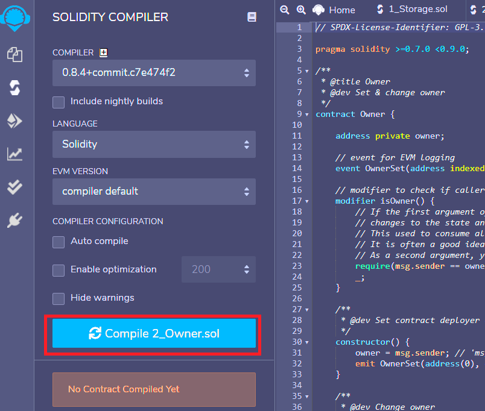
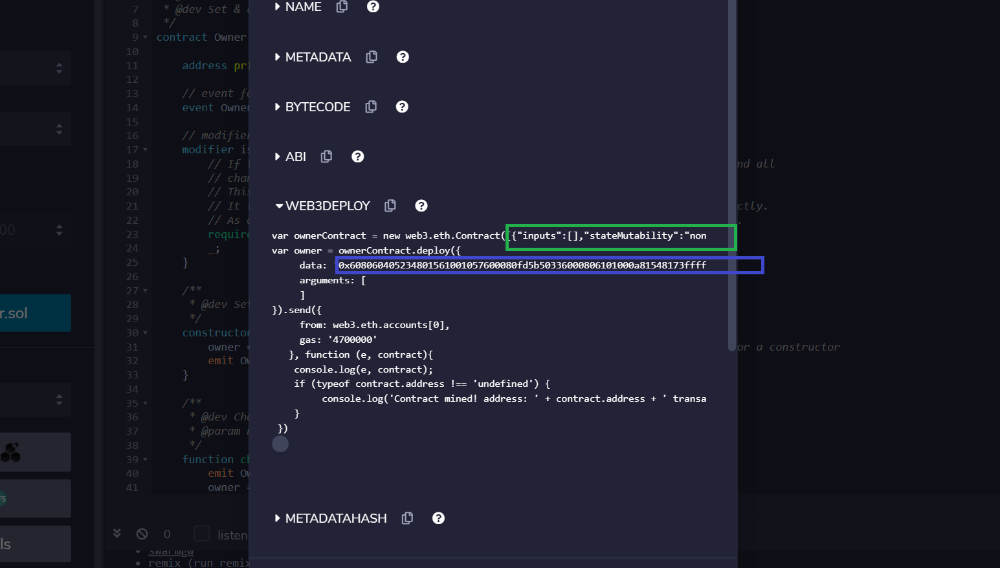

# Read Data From Smart Contract

[Watch Video Tutorial](https://www.youtube.com/watch?v=msT3tpwnyv8&list=PLS5SEs8ZftgXlCGXNfzKdq7nGBcIaVOdN&index=4)

In this step we are deploying a smart contract from web3js. 

## step 1:
Write a smart contract in remix ide. Remix also provides you with some sample smart contracts you can just use them.

## step 2:
Compile the smart contract on remix.

>

## step3:
click on compilation details.

>

## step 4:
The text in the green box is your smart contract's ABI and the blue box shows you the data of your smart contract (hexadecimal string of the binary code of smart contract). You will need the ABI and Data in this step to deploy your smart contract from web3js. 

>

You can create an account using metamask for this step and load it with test ethers from a ropston faucet like https://faucet.ropsten.be/

You will see in the code that here we have explicitly signed our transaction (smart contract creation) using the private key. This is how you should go about sending transactions in a public block chain where the nodes cannot be trusted with your private keys. 

Note: This is the fully manual way of signing and deploying your smart contract. If you want to sign your transaction with metamask then you have to provide your private key like this. Metamask handles everything for you and the code for signing with metamask is also slightly different.

npm link typescript

npm start

or

tsc

node index

