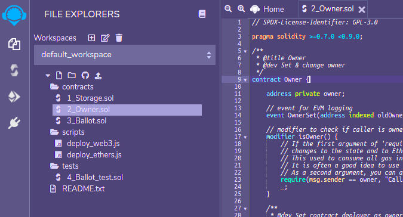
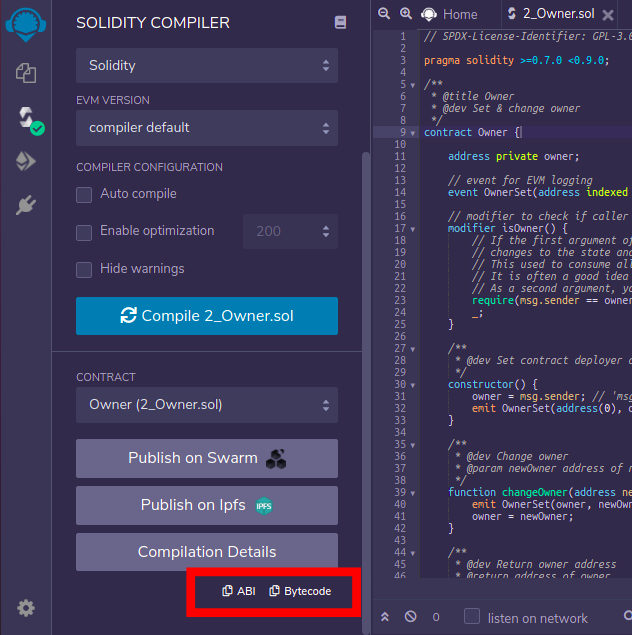
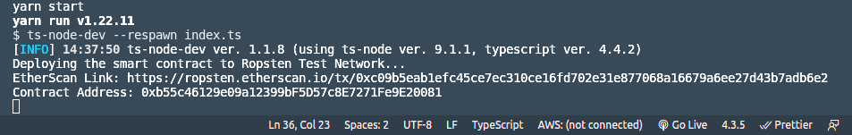

# Step 26: Deploy Smart Contract

## References:

1.  We will follow this [video tutorial](https://www.youtube.com/watch?v=msT3tpwnyv8&list=PLS5SEs8ZftgXlCGXNfzKdq7nGBcIaVOdN&index=4) in this step.

## Step 1

Create `packacge.json`, `tsconfig.json` and `tslint.json` files as in [Step21](../step21_web3_node_getbalance). Also, install the same dependencies, and add the same scripts in `package.json`.

Add `ethereumjs-tx` for signing the transactions and `dotenv` for working with environment variables.

```bash
npm i ethereumjs-tx
npm i -D dotenv
```

## Step 2

In [Step 25](../step25_web3_send_transaction_signed), you created a MetaMask wallet. We will use the same account in this step. Make sure that your account has some fake ETH for Ropsten Public Test Network.

## Step 3

Create a `.env` file and save some environment variables in it in the format given in `.env.example`. In this step, we need only one account.

```
ACCOUNT1_PUBLIC_ADDRESS = REPLACE_WITH_YOUR_ACCOUNT_1_PUBLIC_ADDRESS

ACCOUNT1_PRIVATE_KEY = REPLACE_WITH_YOUR_ACCOUNT_1_PRIVATE_KEY
```

## Step 4:

Write a smart contract in [Remix IDE](https://remix.ethereum.org/). Remix also provides you with some sample smart contracts. Here, we will use the `2_Owner.sol` sample contract provided by Remix IDE. Open the contract from the file explorer section like in the figure below.

<p align="center">
  
</p>

From the toolbar on the left, open `Solidity Comiler`. Now, compile `2_Owner.sol` smart contract as shown below.

<p align="center">
  
</p>

After compilation you can copy the smart contract ABI and Bytecode as highlighted below.

<p align="center">
  
</p>

Create `contractABI.json`, and paste the ABI there.

## Step 5

Create `EthereumAccount.ts`, `SmartContract.ts` and `index.ts` files. You can see this time we have added two methods in `EthereumAccount` class in `EthereumAccount.ts` file. One is the `deploySmartContract` method which deploys the smart contract. The other one is a private method `signAndSendTransaction`. This method signs and sends the transaction to Ethereum. It is created just to avoid code duplication in `deploySmartContract` and `sendSignedTransaction`.

In both `EthereumAccount.ts` and `SmartContract.ts`, replace INFURA_PROJECT_ID with your Infura project ID.

```ts
// Ropsten Test Network endpoint.
const network = "ropsten";
const INFURA_PROJECT_ID = "INFURA_PROJECT_ID";
const RPC_ENDPOINT = `https://${network}.infura.io/v3/${INFURA_PROJECT_ID}`;
```

In `index.ts`, paste the contract bytecode.

```ts
const smartContractByteCode = "PASTE_CONTRACT_BYTECODE";
```

## Step 5

Run the project with the following command:

```bash
npm start
```

or with these commands.

```bash
tsc
node index
```

In the console, a link to [ropsten.etherscan.io](https://ropsten.etherscan.io/) will be printed. You can see that this transaction that deployed the smart contract is now a part of Ropsten Public Test Network. Contract Address will also be printed on the console.

<p align="center">
  
</p>

## Step 6

In `index.ts`, comment the first function and uncomment the second one. Paste the address of the deployed contract from Step 5.

```ts
const contractAddress = "CONTRACT_ADDRESS";
```

Run the project again with `npm start` command. This time `getOwner` method on the contract will be called and address of the owner of the contract (the account you used to deploy the contract) will be printed in the console.
