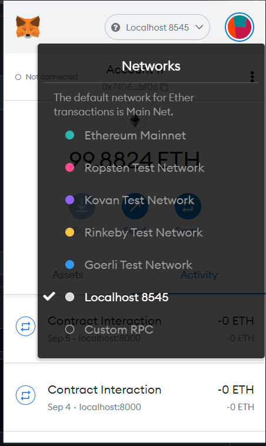

# Setup

### 1) install dependencies (yarn install or npm install)

### 2) Connect to localhost 8454 from metamask (make sure the ganache is running with the settings explained in the backend readme)

>

### 3) Copy a private for one of the accounts in ganache and import it in the metamask.

### 4) Make sure you have the smart contract artficats in the src/abi directory that were generated when you deployed the backend. 

### 5) Run 'gatsby develop' and conenct your metamask with your gatsby's local host if prompted.

# Code Explanation

In a useEffect hook we intiliaze web3 and fetch the user's address

```
 const loadWeb3 = async () => {

    if (Web3.givenProvider) {

      const web3 = new Web3(Web3.givenProvider);
      await Web3.givenProvider.enable();

      const addresses = await web3.eth.getAccounts();
      setUser(addresses[0])
      console.log("addresss = ", addresses);

      setWeb3(web3)
    }
    else {
      console.log("Error in loading web3");
    }


  }
  
  
  
  
  useEffect(() => {
    const web3Init = async () => await loadWeb3()
    web3Init()
  }, [])
```

We can also listen to different web3(metamask) events using the following code. We can get an events on connection, disconnection and changing of accounts.

```
  // Event listeners of web3 
  window.ethereum.on('connect', (connectInfo: any) => {
    console.log("connectInfo", connectInfo)
  });

  window.ethereum.on('accountsChanged', function (accounts: any) {

    console.log(accounts)
    setUser(accounts[0])

  })

  window.ethereum.on('disconnect', (error: any) => {
    console.log("Metamask Disconnected")
    alert(`${error}`)
  });
  
```

After the web 3 has been initialized we are fetching our deployed smart contract. To fetch the smart contract you need 'ABI' and the 'address of the contract'. We are getting this information from the smart contract artifact stored in /src/abi directory. You can see here that instead of hard coding the networkId, we are fetching it dynamically so that we can handle errors properly.


```

  useEffect(() => {


    if (web3) {

      const fetchContract = async () => {
        const networkId = await web3.eth.net.getId()
        const abi = socialMedia.abi as AbiItem | AbiItem[]
        const networkInfo = socialMedia.networks as any
        const networkData = networkInfo[networkId]


        if (networkData) {
          const smartContract = new web3.eth.Contract(abi, networkData.address)
          setContract(smartContract)
        }
        else {

          alert('Social Media contract not deployed to this network')

        }


      }

      fetchContract()
    }

  }, [web3])


```

After fetching the smart contract we can easily run it's functions and fetch state variables as discussed in the previous steps. 

