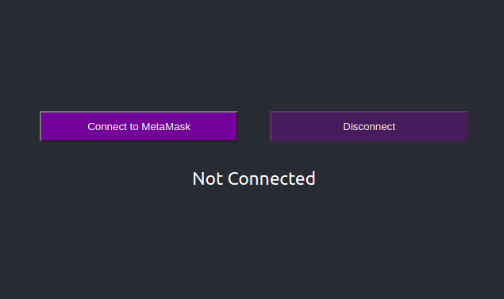
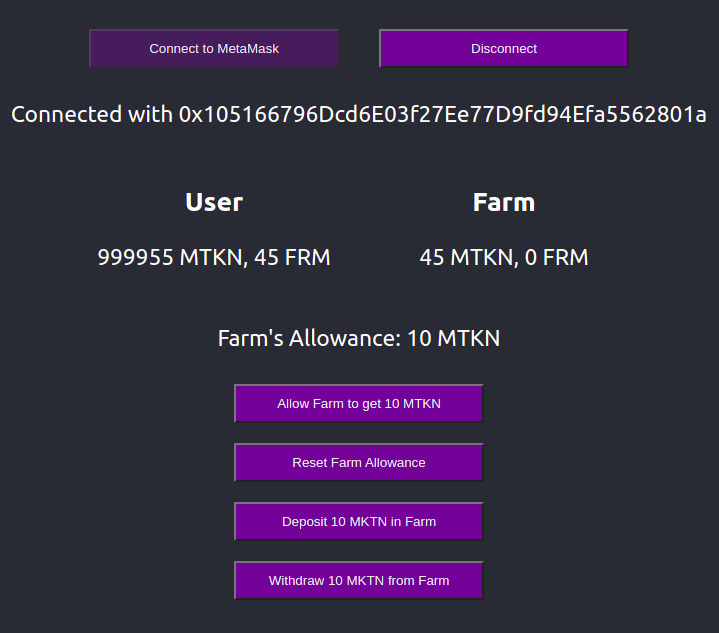

# Create and Deploy a DeFi App

## References

1.  We will follow [this tutorial](https://ethereum.org/en/developers/tutorials/create-and-deploy-a-defi-app/).

## Step 1: Initialize a Truffle Project

In `smartContracts/` directory initialize a new `truffle` project.

```sh
truffle init
```

## Step 2: Add NodeJS Dependencies

Initialize a `package.json` file and install the following dependencies:

```sh
# Initialize a `package.json`.
yarn init -y

# Install
# 1.  @openzeppelin/contracts for creating ERC20 tokens with ease.
# 2.  @truffle/hdwallet-provider for connecting with Ethereum accounts from CLI.
# 3.  dotenv for environment variables.
yarn add @openzeppelin/contracts @truffle/hdwallet-provider dotenv
```

## Step 3: Edit `truffle-config.js`

Edit your `truffle-config.js` file as follows. Remember to change `Solidity` compiler version to the latest version. Here, we are using some environment variables. Let's define them next.

```js
require("dotenv").config({ path: "./.env" });
const HDWalletProvider = require("@truffle/hdwallet-provider");
const MNEMONIC = process.env.MNEMONIC;
const INFURA_PROJECT_ID = process.env.INFURA_PROJECT_ID;
const RPC_ENDPOINT = `https://ropsten.infura.io/v3/${INFURA_PROJECT_ID}`;

module.exports = {
  // Configure your compilers
  compilers: {
    solc: {
      version: "0.8.7",
    },
  },
  // contracts_directory: "./contracts/",
  // contracts_build_directory: "../react-app/src/contracts/abi/",
  networks: {
    development: {
      host: "127.0.0.1",
      port: 7545,
      network_id: "*", // Any network
    },
    ropsten: {
      provider: () => new HDWalletProvider(MNEMONIC, RPC_ENDPOINT),
      network_id: 3,
      gas: 5500000,
      gasPrice: 10e9,
      confirmations: 2,
      timeoutBlocks: 200,
      skipDryRun: true,
    },
  },
};
```

## Step 4: Add Environment Variables

Create a `.env` file. Add environment variables in it as shown in `.env.example`.

```
MNEMONIC = REPLACE_WITH_YOUR_METAMASK_MNEMONIC
INFURA_PROJECT_ID = REPLACE_WITH_YOUR_INFURA_PROJECT_ID
```

## Step 5: Write `MyToken` Contract

In `smartContracts/contracts/` directory, create `MyToken.sol`. `MyToken` is a simple ERC20 Smart Contract/Token. Note that we are inheriting `MyToken` from the `ERC20` smart contract defined in [@openzeppelin](https://openzeppelin.com/contracts/) [library](https://github.com/OpenZeppelin/openzeppelin-contracts). In the constructor, we are giving our token the name `MyToken` and the symbol `MTKN`. Also, we are minting and sending 1 million `MTKN` to the account which is used to deploy this smart contract.

```js
// SPDX-License-Identifier: MIT
pragma solidity ^0.8.7;

import "@openzeppelin/contracts/token/ERC20/ERC20.sol";

contract MyToken is ERC20 {
  constructor() ERC20("MyToken", "MTKN") {
    // Mint 1 million MyToken tokens.
    _mint(msg.sender, 1_000_000e18);
  }
}
```

## Step 6: Write `FarmToken` Contract

In `smartContracts/contracts/` directory, create `FarmToken.sol`. Here, we are creating our `FarmToken` smart contract that also inherits from `ERC20` contract from `@openzeppelin`. We are giving our token the name of `FarmToken` and the symbol of `FRM`. We have also declared (and initialized in the constructor) a state variable to interact with `MyToken` contract. This time, we are minting no tokens at build time.

We have some functions here as well.

1.  With `deposit`, a user can deposit a certain amount of `MTKN` tokens to `FarmToken` contract. In return, `FarmToken` contract mints and sends and equal amount of `FRM` tokens to the user's address.
2.  With `withDraw`, a user can return a certain amoutn of `FRM` tokens back to `FarmToken` contract and get an equal amount of `MTKN` from `FarmToken` contract. `FarmToken` contract, then, burns the `FRM` tokens returned by the user.
3.  With `balance`, anyone can check the amount of `MTKN` tokens currently in possession of `FarmToken` contract.

```js
// SPDX-License-Identifier: MIT
pragma solidity ^0.8.7;

import "@openzeppelin/contracts/token/ERC20/IERC20.sol";
import "@openzeppelin/contracts/utils/Address.sol";
import "@openzeppelin/contracts/token/ERC20/utils/SafeERC20.sol";
import "@openzeppelin/contracts/token/ERC20/ERC20.sol";

contract FarmToken is ERC20 {
  using Address for address;
  using SafeERC20 for IERC20;

  IERC20 public token;

  constructor(address _token) ERC20("FarmToken", "FRM") {
    token = IERC20(_token);
  }

  function balance() public view returns(uint256) {
    return token.balanceOf(address(this));
  }

  function deposit(uint256 amount) public returns(bool) {
    require(amount > 0, "Deposit amount cannot be zero.");
    token.safeTransferFrom(msg.sender, address(this), amount);
    _mint(msg.sender, amount);
    return true;
  }

  function withDraw(uint256 amount) public returns(bool) {
    _burn(msg.sender, amount);
    token.safeTransfer(msg.sender, amount);
    return true;
  }
}
```

## Step 7: Compile Solidity Smart Contracts

Compile these contracts with the solidity compiler.

```sh
truffle compile
```

## Step 8: Deploy Smart Contracts to Local Blockchain

In `smartContracts/migrations/1_initial_migration.js` file, write the following script to deploy the smart contracts. Note that after deploying `MyToken` contract, we are passing its address to `FarmToken`'s constructor as an argument.

```js
const MyToken = artifacts.require("MyToken");
const FarmToken = artifacts.require("FarmToken");

module.exports = async function (deployer, network, accounts) {
  await deployer.deploy(MyToken, { from: accounts[0] });
  const myToken = await MyToken.deployed();

  await deployer.deploy(FarmToken, myToken.address, { from: accounts[0] });
};
```

Run `Ganache` and deploy the smart contracts with the following command:

```sh
# If you don't pass any network argument, truffle will by default try to deploy
# to development network (localhost).
truffle migrate --reset --network development
```

## Step 9: Run Scripts

In `smartContracts/scripts/` directory, create `getMyTokenBalance.js`, `transferMyTokenToFarmToken.js` and `withdrawMyTokenFromTokenFarm.js` scripts to interact with the deployed networks. Go through these scripts; the comments in the files are self explanatory. Run the scripts with these commands.

```sh
truffle exec scripts/getMyTokenBalance.js
truffle exec scripts/transferMyTokenToFarmToken.js
truffle exec scripts/withdrawMyTokenFromTokenFarm.js
```

## Step 10: Deploy Smart Contracts to Ropsten

In order to deploy to Ropsten through our MetaMask account, we will use our 12 word long MetaMask mnemonic and `@truffle/hdwallet-provider` package. We, also, need an Infura project id to create our RPC endpoint. Save the mnemonic and the Infura project id in `.env`. We have also covered these things in earlier steps. Run the following commands to deploy `MyToken` and `FarmToken` contracts to the Ropsten Public Testnet.

**Note: Remember to copy the addresses to which our contracts are deployed. We will use them later.**

```sh
truffle migrate --reset --network ropsten
```

## Step 11: Verify Smart Contract Source Code on EtherScan

In this step, we will verify our smart contract source code on EtherScan. So, it will be publicly available for auditing. For this, install `truffle-plugin-verify` package.

```sh
yarn add -D truffle-plugin-verify
```

Now, create an account on [EtherScan](https://etherscan.io/register), and create an API key. Save this key in `.env` file with other environment variables.

```
ETHERSCAN_API_KEY = REPLACE_WITH_YOUR_ETHERSCAN_API_KEY
```

In `truffle-config.js` file, add these options.

```js
module.exports = {
  // ... other options

  plugins: ["truffle-plugin-verify"],
  api_keys: {
    etherscan: process.env.ETHERSCAN_API_KEY,
  },
};
```

Now, you can verify the source code with this single command.

```sh
npx truffle run verify MyToken FarmToken --network ropsten
```

You can read more on this:

1.  [truffle-plugin-verify Repository](https://github.com/rkalis/truffle-plugin-verify)
2.  [Verify smart contract inheriting from OpenZeppelin Contracts](https://forum.openzeppelin.com/t/verify-smart-contract-inheriting-from-openzeppelin-contracts/4119)

## Step 12: Initialize a React App

In `reactApp/` directory, initialize a boiler-plate React App with TypeScript template.

```sh
npx create-react-app . --template typescript
```

## Step 13: TypeScript Types for Contracts

We will use [TypeChain](https://github.com/dethcrypto/TypeChain) for generating TypeScript types for our smart contracts.

```sh
yarn add -D typechain @typechain/web3-v1 @types/bn.js
```

Add these scripts in `react-app/package.json`.

```json
"scripts": {
  "generate-types": "typechain --target=web3-v1 --out-dir=\"src/contracts/types\" \"src/contracts/abi/*.json\"",
  "postinstall": "yarn generate-types"
}
```

Go to the following links and copy the ABIs of your `MyToken` and `FarmToken` contracts. Save them in `react-app/src/contracts/abi/MyToken.json` and `react-app/src/contracts/abi/FarmToken.json`.

```
https://ropsten.etherscan.io/address/YOUR_MY_TOKEN_ADDRESS#code
https://ropsten.etherscan.io/address/YOUR_FARM_TOKEN_ADDRESS#code
```

**Note: If you don't verify your smart contract source code on EtherScan, you won't be able to get the ABIs from there!**

Now, generate TypeScript types for your smart contracts in `react-app/src/contracts/types/` directory with the following command:

```sh
yarn generate-types
```

## Step 14: Install @web3-react

In `react-app/` directory, install [@web3-react](https://github.com/NoahZinsmeister/web3-react).

```sh
# 1.  @web3-react/core is the core @web3-react library.
# 2.  @web3-react/injected-connector is for connecting with wallets that are
#     installed as an extension in browsers like MetaMask.
# 2.  web3 for interactions with ethereum.
yarn add @web3-react/core @web3-react/injected-connector web3
```

In `react-app/src/components/wallet/index.ts` paste the following code:

```ts
import { InjectedConnector } from "@web3-react/injected-connector";

export const injector = new InjectedConnector({
  supportedChainIds: [
    // 1, // Mainnet
    3, // Ropsten
    4, // Rinkeby
    5, // Goerli
    42, // Kovan
  ],
});
```

`InjectedConnector` helps us connect to Wallets which are installed as an extention in browser like MetaMask.

Now, in `react-app/src/components/web3ReactProvider/index.tsx` file, create a `Web3ReactProvider` component.

```ts
import { FC } from "react";
import { Web3ReactProvider } from "@web3-react/core";
import Web3 from "web3";

const getLibrary = (provider: any) => {
  return new Web3(provider);
};

export const Web3React: FC = ({ children }) => (
  <Web3ReactProvider getLibrary={getLibrary}>{children}</Web3ReactProvider>
);
```

Now, use this provider in `react-app/src/index.tsx` to wrap our main `App` component.

```ts
import React from "react";
import ReactDOM from "react-dom";
import { Web3React } from "./components/web3ReactProvider";
import App from "./components/app";
import "./index.css";

ReactDOM.render(
  <React.StrictMode>
    <Web3React>
      <App />
    </Web3React>
  </React.StrictMode>,
  document.getElementById("root")
);
```

Now, with the help of `useWeb3React` hook, we can use `web3` and connect to `MetaMask` in an abstract way.

```ts
const { activate, deactivate, active, library } = useWeb3React();
```

## Step 15: Create `AppContext` Using React Context API

I have created all the UI in `App` component and moved all the functions and state management to a context. Feel free to implement the client side as you like.

In `react-app/src/context/appContextProvider/index.tsx`, I have used `useWeb3React` hook to create some functions to interact with our `MyToken` and `FarmToken` smart contracts. Read the comments in the file to understand what's going on. Some important functions are the following:

```ts
// Connect to MetaMask.
function connect();
// Disconnect from MetaMask.
function disconnect();
// Allow `FarmToken` contract to spend 'MTKN' tokens from user's address.
function allowFarm(tokensToAllow: number);
// Deposit `MTKN` tokens in `FarmToken` contract and get an equal amount of `FRM` tokens.
function depositInFarm(tokensToDeposit: number);
// Withdraw `MTKN` tokens from `FarmToken` contract by returning an equal amount of `FRM` tokens.
function withdrawFromFarm(tokensToWithdraw: number);
// Get the number of `MTKN` and `FRM` tokens in possession of the user and `FarmToken` contract.
function getBalances();
// Get the number of `MTKN` tokens `FarmToken` contract is allowed to spend from user's account.
function getFarmAllowance();
// Subscribe to `Approval` and `Transfer` events from `MyToken` contract.
function subscribeForBalanceUpdates();
```

Use the `AppContextProvider` in `react-app/src/index.tsx` to wrap our `App` component.

```ts
import React from "react";
import ReactDOM from "react-dom";
import { Web3React } from "./components/web3ReactProvider";
import { AppContextProvider } from "./context/appContextProvider";
import App from "./components/app";
import "./index.css";

ReactDOM.render(
  <React.StrictMode>
    <Web3React>
      <AppContextProvider>
        <App />
      </AppContextProvider>
    </Web3React>
  </React.StrictMode>,
  document.getElementById("root")
);
```

## Step 16: Environment Variables

Our `AppContextProvider` component uses `MyToken` and `FarmToken` contract addresses from environment. Let's define them in `react-app/.env` file. I have provided my `MyToken` and `FarmToken` contract addresses in `react-app/.env.example`; replace them with your own contract addresses.

```
REACT_APP_MY_TOKEN_CONTRACT_ADDRESS = 0x0eF6D64170a6C430A671A8b518b95b535E5deE86
REACT_APP_FARM_TOKEN_CONTRACT_ADDRESS = 0xAdc8b25015856f52264F6119d72484091f66D8e7
```

Define types for these environment variables in `react-app/src/react-app-env.d.ts`.

```ts
export declare global {
  namespace NodeJS {
    interface ProcessEnv {
      REACT_APP_MY_TOKEN_CONTRACT_ADDRESS: string;
      REACT_APP_FARM_TOKEN_CONTRACT_ADDRESS: string;
    }
  }
}
```

## Step 17: `App` Component

Finally, create the UI for our client side in `react-app/src/components/app/index.tsx`. I have tried my best to keep this component simple. The code is mostly JSX. All the functions and state values come from `AppContext`.

## Step 18: Let's Run It

Now, start the react app.

```sh
yarn start
```

It will serve the following page on [localhost](http://localhost:3000/). It shows a connect and a disconnect button for MetaMask, and the connection status.

<p align="center">
  
</p>

After connecting your account to this DApp, you will see the following screen. It shows the number of `MTKN` and `FRM` tokens in possession of the user and the `FarmToken` contract. It also shows the number `MTKN` tokens `FarmToken` contract is allowed to use from the user's account. There are also some buttons to interact with the contracts.

<p align="center">
  
</p>

The UI updates the balances automatically when a transaction is performed using the buttons, thanks to `Web3` subscriptions. The balances are also updated when the user changes his/her account from the MetaMask wallet, thanks to `useEffect` hook.

You can read more on Web3 Subscriptions here:

1.  [Subscribing to Contract Events- Web3 Docs](https://web3js.readthedocs.io/en/v1.4.0/web3-eth-contract.html#contract-events)
2.  [Subscribing to Ethereum Events Using Web3 Subscribe Module](https://web3js.readthedocs.io/en/v1.4.0/web3-eth-subscribe.html)
3.  [3 Ways to Subscribe to Events with Web3.js- Blog](https://www.coinclarified.com/p/3-ways-to-subscribe-to-events-with-web3-js/)
