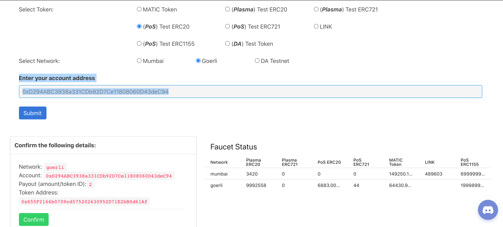

# Ethereum Matic Bridge
Move DERC20 tokens Dummy ERC20 tokens from Ethereum Goerli testnet to Polygon Mumbai testnet using POS Bridge 
You will need DERC20 tokens in an account you control(have private key for) e.g a Metamask account. We will get DERC20 tokens from faucet https://faucet.matic.network/ into a Metamask Account. Copy Metamask address and request DERC20. 

Select Token: POS (ERC20 ). Select Network: Goerli. Click Submit. Copy Token Address. Click Confirm! See image below


Add DERC20 Asset to your Metamask to view the balance of your DERC20. After a while check your Metamask to see new balance DERC20 Tokens

### About

Make use of a POS Ethereum-Matic bridge to move tokens between the mapped networks
Goerli testnet on Ethereum and Mumbai testnet on Polygon Matic Network.
To move Ethereum you need to connect with Polygon Mainnet , this example will use Goerli to Mumbai and reverse
To view [Mapped Tokens at Matic documentation](https://docs.matic.network/docs/develop/network-details/mapped-tokens)
To view [Matic Documentation](https://docs.matic.network/docs/develop/ethereum-matic/pos/using-sdk/erc20)
To view [Important Addresses e.g Root Chain Proxy Managers etc on Goerli Visit](https://github.com/maticnetwork/static/blob/master/network/testnet/mumbai/index.json)
To view [Important Addresses e.g Root Chain Proxy Managers etc on Ethereum Visit](https://github.com/maticnetwork/static/blob/master/network/mainnet/v1/index.json)


For information on POS and Plasma deposit and withdrawal timelines, token types etc 
[Visit Docs](https://docs.matic.network/docs/develop/ethereum-matic/getting-started)

You will need some Goerli eth here are some faucets
[https://goerli-faucet.slock.it/](https://goerli-faucet.slock.it/)
[https://faucet.goerli.mudit.blog/](https://faucet.goerli.mudit.blog/)
[https://gitter.im/goerli/testnet](https://gitter.im/goerli/testnet)

You will need some sufficient Matic Tokens for Mumbai testnet here are some faucets
[https://faucet.matic.network/](https://faucet.matic.network/)

You will need to register for Goerli and Mumbai RPC node connections
[Infura](https://infura.io/)
[https://rpc.maticvigil.com/](https://rpc.maticvigil.com/)

### Get started

1. Install packages
```sh
$ npm install 
```

2. Run code to deposit tokens from Goerli => Mumbai using POS Bridge
```sh
$ node deposit.js
```

2. Run code to withdraw tokens from Mumbai => Goerli using POS Bridge
```sh
$ node withdraw.js
```

### To do
- Plasma Bridge transfers between chains