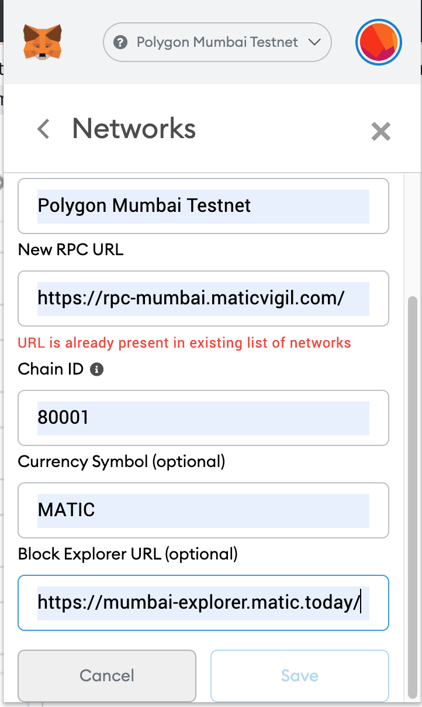
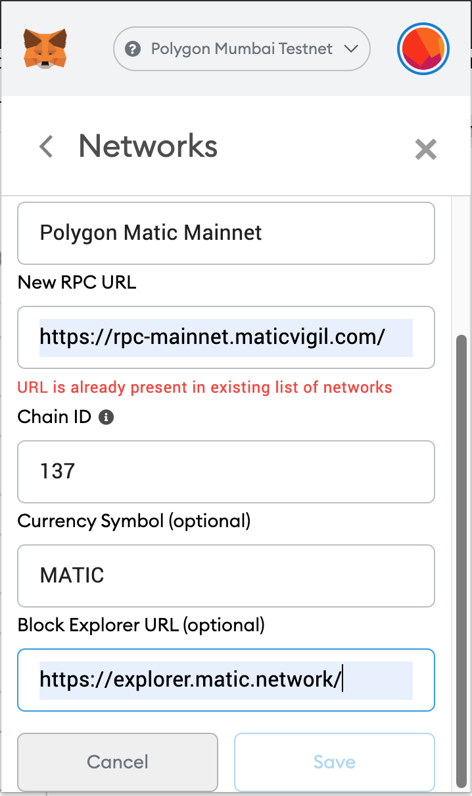
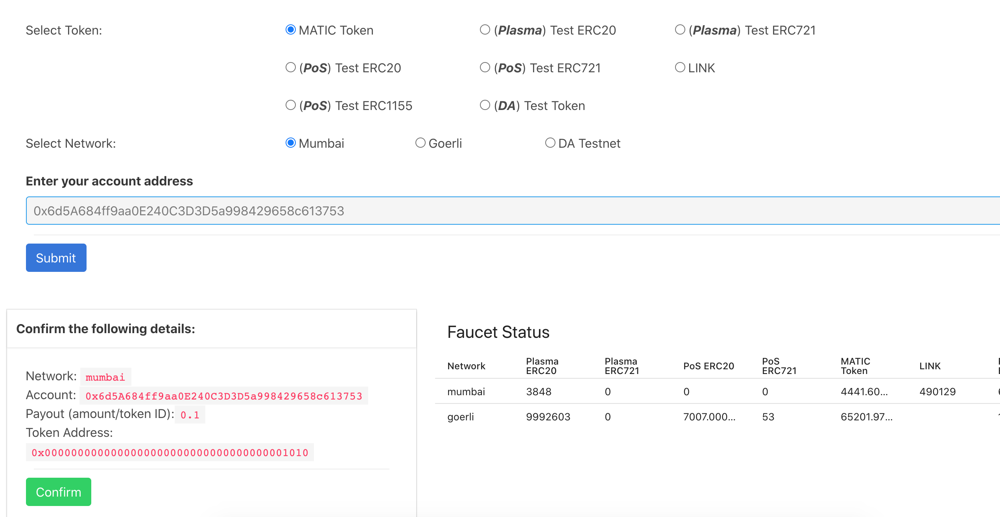
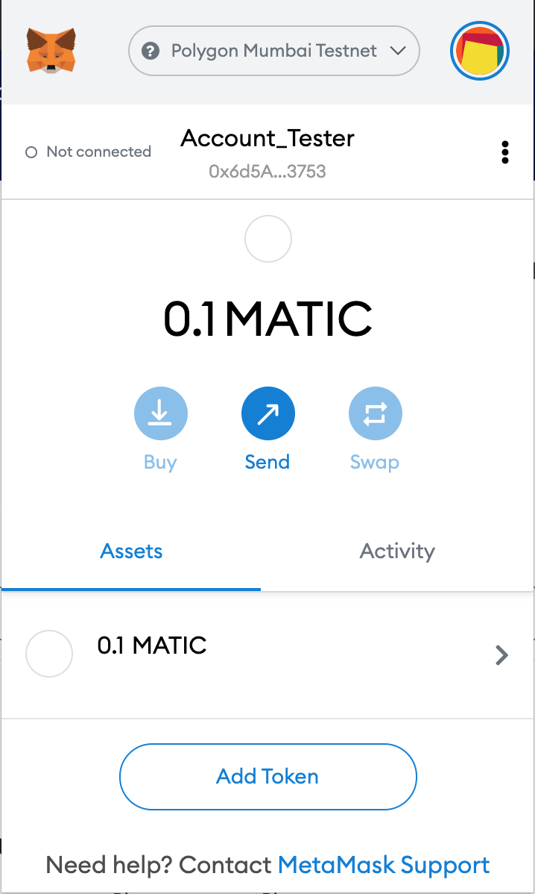

# NFT project deployed on Polygon/Matic network

### About
Panacloud NFT project deployed to Polygon/Network 
[Read accompanying document on Polygon](https://docs.google.com/document/d/1iqX6hLNrKw80mvW0aXwOE6rmmcoMcfAM8NcSiXRE-_o/edit?usp=sharing)  

### Technology Stack and Tools

* [Node Version Manager](https://heynode.com/tutorial/install-nodejs-locally-nvm) - node version manager
* [Polygon/Matic](https://polygon.technology/) - Polygon Matic Network
* [ERC721](https://docs.openzeppelin.com/contracts/3.x/erc721) - ERC721 Token standard (NFTs)
* [Metamask Wallet](https://metamask.io/) - Metamask Wallet
* [Truffle](https://www.trufflesuite.com/) - development framework
* [React](https://reactjs.org/) - front end framework
* [Redux](https://redux.js.org/) - state management framework for React
* [Solidity](https://docs.soliditylang.org/en/v0.7.4/) - ethereum smart contract language
* [Ganache](https://www.trufflesuite.com/ganache) - local blockchain development
* [Web3](https://web3js.readthedocs.io/en/v1.3.0/) - library interact with ethereum nodes 
* [JavaScript](https://www.javascript.com/) - logic front end and testing smart contracts
* [Infura](https://infura.io/) - connection to ethereum networks 
* [Open Zeppelin](https://infura.io/) - smart contract libraries 

##### Folder / Directory Structure (key folders)
* NFT Polygon Class
  * node_modules
  * public 
    * index.html
  * src
    * backEnd
        * abis
        * contracts
        * migrations
        * scripts
        * test
    * components
    * images
    * store
    * index.js
    * .env
    * .env.example
    * truffle.js
    * package.json

### Preconfiguration, Installation and Running project locally 

1. You will need nvm to install specific version node v12.10.0
```sh
$ curl -o- https://raw.githubusercontent.com/nvm-sh/nvm/v0.37.2/install.sh | bash
$ source ~/.nvm/nvm.sh
```
Restart your terminal

2. Install node v12.10.0
```sh
$ nvm install 12.10.0
$ nvm alias default 12.10.0
$ nvm use default
```

3. Install truffle globally
```sh
$ npm install -g truffle
```

4. If opting to use ganache-cli vs [Ganache GUI](https://www.trufflesuite.com/ganache), install ganache-cli globally
```sh
$ npm install -g ganache-cli
$ ganache-cli
```
Run ganache-cli in different terminal and keep running

5. Run IPFS
   Install IPFS:
```sh
$ npm i -g ipfs 
```

6.  Run IPFS Node in a different terminal and keep running:
```sh
$ jsipfs daemon
```

7. Enter project directory and install dependancies
```sh
$ cd nft_deploy_polygon_main
$ npm install 
```

### Migrating contracts and Testing Locally to ensure all is working well

1. To compile contracts e.g you make changes to contracts
```sh
$ truffle compile 
```

Make sure your truffle.js or truffle-config.js file is properly configured for development environment.
2. Migrate contracts to local running instance ganache
```sh
$ truffle migrate --reset 
```

3. To test contracts 
```sh
$ truffle test
```

4. Interact with locally deployed contracts and excute script to mint tokens
```sh
$ truffle migrate --reset
$ truffle exec src/backEnd/scripts/mint.js --network development
$
```

5. Run app on localhost front-end
1. Run app locally 
```sh
$ npm start
```
Enter dApp in browser at localhost:3000

### Deploying to Polygon/Matic Mumbai testnet network

You can also read up on our [Polygon document here](https://docs.google.com/document/d/1iqX6hLNrKw80mvW0aXwOE6rmmcoMcfAM8NcSiXRE-_o/edit?usp=sharing) . [You can also lookup with
Matic Developer documentation here](https://docs.matic.network/docs/develop/truffle)

1. Setup up Polygon/Matic network on Metamask under Networks Custom RPC configuration.


<span>
</span>


2. You will need Matic tokens in an account that will deploy contract
We will get MATIC tokens from example faucet [https://faucet.matic.network/](https://faucet.matic.network/) into 
a Metamask Account. Copy Metamask address and request MATIC. See image below

After a little while you should see a new balance in your address on Mumbai network



3. Ensure truffle is configured for Polygon Matic Mumbai Test network with added configuration like below
Make sure you have added the private key of account that received Matic tokens into .env file
See .env.example 
```sh
require('babel-register');
require('babel-polyfill');
require('dotenv').config();
const HDWalletProvider = require('truffle-hdwallet-provider-privkey');
const privateKey = process.env.PRIVATE_KEYS || ""
const rpcMumbaiURI = process.env.INFURA_MUMBAI_URI

...

module.exports = {
  networks: {
    development: {
      ...
    },
    matic: {
      provider: () => new HDWalletProvider([privateKey], rpcMumbaiURI),
      network_id: 80001,
      confirmations: 2,
      timeoutBlocks: 200,
      skipDryRun: true
    },
  },
  ...
```
Get a INFURA Polygon Matic Mumbai testnet URI to connect to node from [https://rpc.maticvigil.com/](https://rpc.maticvigil.com/)
See example in .env.example file 


2. Deploy using truffle.
```sh
$ truffle migrate --network matic
$ truffle networks 
```
truffle networks above will show you the networks to which NFT contract has been deployed
copy contract address and or transaction hash from console output and ...
you can verify deployment on [https://mumbai-explorer.matic.today/](https://mumbai-explorer.matic.today/)

Stop and restart ipfs deamon using ... jsipfs daemon
If you have timeout or rate limit challenges Infura RPC or IPFS daemon consider waiting sometime and restart process later eg deploy and mint.
3. Mint NFT's on Matic Network( ensure you have sufficient Matic tokens)
```sh
$ truffle exec src/backEnd/scripts/mint.js --network matic
```

4. Run app on localhost front-end and interact with app
```sh
$ npm start
```

### Optional publish on IPFS

1. Build app
```sh
$ npm run build
```
2. Publish on IPFS
```sh
$ jsipfs add -r build
```
3. Copy the latest generated hash and paste into the place of hash below:
https://ipfs.io/ipfs/hash For the first time may take a while to load dApp
Create Human readable link [Use this site](https://bitly.com/)

### Optional publish front end to Surge
1. Run build and enter build directory
```sh
$ npm run build
$ cd build
```
2. Install surge globally:
```sh
$ npm i -g surge
```
3. Deploy to surge. 
```sh
$ surge
```
...and follow the instructions

### Optional Matic-Ethereum bridge
As you develop on Matic you may need to make use of bridges between the two networks 

Find out how to move tokens between Ethereum network e.g Goerli testnet and Polygon Matic network e.g Matic testnet
- Related Resources:

https://github.com/realdiganta/ethereum-to-polygon-bridge
https://github.com/shenwilly/ubi-games-bridge

- The latter is in typescript.

### Troubleshooting

Trouble Shooting


1. Connecting with URI  rpc-mumbai.maticvigil.com without registering for a node increasingly gives timeouts. If you could not mint all 20 at some point, try registering node at https://rpc.maticvigil.com/ and using this RPC URL.


2. When balance Matic is lower than 0.25 it sometimes say insufficient funds when deploying. Try requesting more tokens from the faucet. You might have to wait a few minutes in between requests.


3. The jsipfs daemon stops a lot now e.g rate limit etc, so running it just before you mint is best. You can also reduce the number of NFTs you mint in this project by removing some of the files from the project.


4. If you have trouble starting your app with $ npm run start, then update your package.json file with the following web pack version:


    "webpack": "4.44.2"

