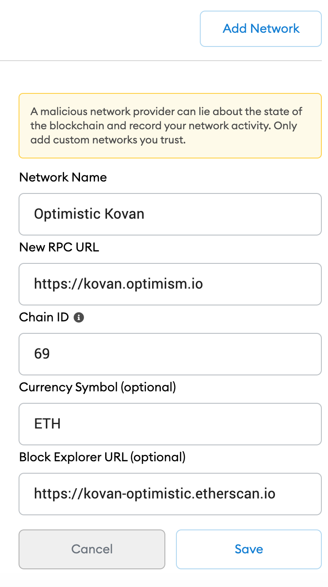

# About
[Resources](https://www.youtube.com/watch?v=W9FgIdr89mU)
Deploy ERC20 token to Optimistic Networks using Truffle Optimistic Box 
Read up on our notes on [Optimism, Layer scaling etc here](https://docs.google.com/document/d/1qJjz3rzGDKnVjs-qDdwDdGmDdtkLWmMjH4gUqrLP7Is/edit)

Project uses truffle optimism box in addition to create-react-app and places build folder in src to demonstrate a full stack app / dapp deployed to Optimistic networks e.g local optimistic node, kovan optimistic network and ethereum optimistic network in addition to normal Ethereum network deployments e.g local ganache, testnets kovan etc. The project makes use of the [Truffle Optimistic Box](https://www.trufflesuite.com/boxes/optimism)

To get started! First See below from original READ.me for info on Optimism Box (Ignore ##Installation section on truffle unbox)  optimism box. Below is a summary of key points to compile, run, test, deploy ERC20 to networks Ethereum and Optimism

Project makes some slight changes to original truffle box folder structure so as to help see Optimism side by side
Ethereum networks on backend and frontend. 

--------------------------------KEY SUMMARY-----------------------------------------------------------------------

1.  Run Install pacakges
```sh
npm install 
```

2. Populate your environment variables .env see .env.example 
- Leave the MNEMONIC as is, it works with Optimism

3. Ensure Docker is installed and running on your computer
```sh
docker-compose up
```
or if Docker Desktop is installed Start Dock

4. Compile, deploy and test Contracts Etherem networks e.g Local Ganache, Kovan 
Ensure ganache is running in seperate terminal
```sh
ganache-cli
npm run compile:evm
npm run test:evm
```
- Migrate to local ganache
```sh
npm run migrate:evm development
```
- Migrate to Kovan
```sh
npm run migrate:evm kovan
```

5. Configure Metamask networks for Optimistic Networks
[You can also lookup with Optimism Developer documentation here](https://community.optimism.io/docs/) or
reference with [Github repository](https://github.com/ethereum-optimism/optimism-tutorial)
@eth-optimism/solc is the package that will allow us to compile contracts for Optimism

- Optimism networks to be discuseed here are: local Optimism node, Optimistic Kovan(optimism-kovan) and Optimistic Ethereum(optimism-ethereum). Caution as testnet and mainnet networks are still in early stages at time of writing this document

- Setup networks in Metamask, see images below 

<span>


6. Compile, deploy and test Contracts Optimistic networks 

Key considerations e.g ETH to pay for fees 
- you import copy local running docker based optimistic blockchain accounts similar to when using ganache
- for local blockchain ensure all transactions to blockchain use {gasPrice: 0}
- for 0ptimistic Kovan network acquire Optimistic Kovan ETH by 
  Get Kovan testnet ETH into a Metamask account e.g use faucets like https://gitter.im/kovan-testnet/faucet or https://enjin.io/software/kovan-faucet or https://linkfaucet.protofire.io/kovan
  Ensure Metamask is setup correctly for Optimistic Kovan Network see earlier [section or here](https://community.optimism.io/docs/developers/metamask.html#connecting-manually)
  [Bridge Kovan ETH to Optimistic Kovan ETH here](https://gateway.optimism.io/)
- for Optimistc Mainnet at time of writing is restricted may need a whitelisting process. However briding tokens is similar to Optimistic Kovan at [gateway](https://gateway.optimism.io/)
- for networks besides local, e.g Optimistic Kovan, Optimistic Mainnet care should be taken with gasLimits 
and gasFees 
- OVM and EVM may differ e.g revert messages etc 

e.g Optimistic Local, Optimistic Kovan,  Optimistc Mainnet
You will require SSH setup for Github - [visit here for info](https://docs.github.com/en/github/authenticating-to-github/connecting-to-github-with-ssh)
Ensure Local Optimistic Blockchain is running in background using docker
Setup once using npm run installLocalOptimism (It may take a long time)
To start later on use =>  cd optimism/ops && docker-compose up
```sh
npm run startLocalOptimism
npm run compile:ovm
npm run test:ovm optimistic_local
```
To stop docker for local node use => npm run stopLocalOptimism

- Migrate to Optimistic Local 
```sh
npm run migrate:ovm optimistic_local
```

- Migrate to Optimistic Kovan
```sh
npm run migrate:ovm optimistic_kovan
```

- Migrate to Optimistic Mainnet
```sh
npm run migrate:ovm optimistic_mainnet
```

6. Simple connection/interaction with front end 
Change the network in Metamask to interact with contract deployed on chosen network e.g Optimistic Kovan
```sh
npm run start
```
Add as an Asset in Metamask the deployed token copying its address 
from the navbar follow [instructions here](https://metamask.zendesk.com/hc/en-us/articles/360015489031-How-to-view-see-your-tokens-custom-tokens-in-MetaMask)


You can send tokens between accounts using Metamask the same way as in on Ethereum networks, care is 
required with gas as default 21,000 in Metamask may need changing on Optimistic Kovan and Optimistic Ethereum 
to higher values.

Refreshs page when you change accounts or transact on front end 

--------MORE DETAILED INFO _ SEE ORIGINAL TRUFFLE BOX READ.ME BELOW--------------------------------------


[You will need to add Optimism network add-on in Infura](https://blog.infura.io/infura-launches-support-for-optimistic-ethereum/)


# Optimism Box

- [Requirements](#requirements)
- [Installation](#installation)
- [Setup](#setup)
  * [Using the .env File](#using-the-env-file)
  * [New Configuration File](#new-configuration-file)
  * [New Directory Structure for Artifacts](#new-directory-structure-for-artifacts)
- [Optimistic Ethereum](#optimistic-ethereum)
  * [Compiling](#compiling)
  * [Migrating](#migrating)
  * [Basic Commands](#basic-commands)
  * [Testing](#testing)
  * [Communication Between Ethereum and Optimism Chains](#communication-between-ethereum-and-optimism-chains)
- [Support](#support)

<small><i><a href='http://ecotrust-canada.github.io/markdown-toc/'>Table of contents generated with markdown-toc</a></i></small>


This Truffle Optimism Box provides you with the boilerplate structure necessary to start coding for Optimism's Ethereum Layer 2 solution. For detailed information on how Optimism works, please see the documentation [here](http://community.optimism.io/docs/developers/integration.html#).

As a starting point, this box contains only the SimpleStorage Solidity contract. Including minimal code was a conscious decision as this box is meant to provide the initial building blocks needed to get to work on Optimism without pushing developers to write any particular sort of application. With this box, you will be able to compile, migrate, and test Optimistic Solidity code against a variety of Optimism test networks.

Optimism's Layer 2 solution is almost fully compatible with the EVM, though it uses an "optimistic" EVM called the OVM. The main difference between the EVM and the OVM that developers will notice is that some opcodes are not available for contracts that are deployed to the OVM. You can see the complete list of differences between Optimism's fork of the `solc` compiler and the original [here](https://github.com/ethereum-optimism/solidity/compare/27d51765c0623c9f6aef7c00214e9fe705c331b1...develop-0.6).

## Requirements

The Optimism Box has the following requirements:

- [Node.js](https://nodejs.org/) 10.x or later
- [NPM](https://docs.npmjs.com/cli/) version 5.2 or later
- [docker](https://docs.docker.com/get-docker/), version 19.03.12 or later
- [docker-compose](https://docs.docker.com/compose/install/), version 1.27.3 or later
- Recommended Docker memory allocation of >=8 GB.
- Windows, Linux or MacOS


Helpful, but optional:
- An [Infura](https://infura.io/) account and Project ID
- A [MetaMask](https://metamask.io/) account


## Installation

> Note that this installation command will only work once the box is published (in the interim you can use `truffle unbox https://github.com/truffle-box/optimism-box`).

```bash
$ truffle unbox optimism
```

## Setup

### Using the env File

You will need at least one mnemonic to use with the network. The `.dotenv` npm package has been installed for you, and you will need to create a `.env` file for storing your mnemonic and any other needed private information.

The `.env` file is ignored by git in this project, to help protect your private data. In general, it is good security practice to avoid committing information about your private keys to github. The `truffle-config.ovm.js` file expects a `GANACHE_MNEMONIC` and a `KOVAN_MNEMONIC` value to exist in `.env` for running commands on each of these networks, as well as a default `MNEMONIC` for the optimistic network we will run locally.

If you are unfamiliar with using `.env` for managing your mnemonics and other keys, the basic steps for doing so are below:

1) Use `touch .env` in the command line to create a `.env` file at the root of your project.
2) Open the `.env` file in your preferred IDE
3) Add the following, filling in your own Infura project key and mnemonics:

```
MNEMONIC="candy maple cake sugar pudding cream honey rich smooth crumble sweet treat"
INFURA_PROJECT_ID="<Your Infura Project ID>"
GANACHE_MNEMONIC="<Your Ganache Mnemonic>"
KOVAN_MNEMONIC="<Your Kovan Mnemonic>"
```

_Note: the value for the `MNEMONIC` above is the one you should use, as it is expected within the local optimistic ethereum network we will run in this Truffle Box._

4) As you develop your project, you can put any other sensitive information in this file. You can access it from other files with `require('dotenv').config()` and refer to the variable you need with `process.env['<YOUR_VARIABLE>']`.

### New Configuration File

A new configuration file exists in this project: `truffle-config.ovm.js`. This file contains a reference to the new file location of the `contracts_build_directory` and `contracts_directory` for Optimism contracts and lists several networks for running the Optimism Layer 2 network instance (see [below](#migrating)).

Please note, the classic `truffle-config.js` configuration file is included here as well, because you will eventually want to deploy contracts to Ethereum as well. All normal truffle commands (`truffle compile`, `truffle migrate`, etc.) will use this config file and save built files to `build/ethereum-contracts`. You can save Solidity contracts that you wish to deploy to Ethereum in the `contracts/ethereum` folder.

### New Directory Structure for Artifacts

When you compile or migrate, the resulting `json` files will be at `build/optimism-contracts/`. This is to distinguish them from any Ethereum contracts you build, which will live in `build/ethereum-contracts`. As we have included the appropriate `contracts_build_directory` in each configuration file, Truffle will know which set of built files to reference!

## Optimistic Ethereum

### Compiling

To compile your project using the Optimistic `solc` compiler, run the following in your terminal:

```
npm run compile:ovm
```

This script lets Truffle know to use the `truffle-config.ovm.js` configuration file, which references the Optimistic `solc` compiler. When adding new contracts to compile, you may find some discrepancies and errors, so please remember to keep an eye on [differences between solc and optimistic solc](https://github.com/ethereum-optimism/solidity/compare/27d51765c0623c9f6aef7c00214e9fe705c331b1...develop-0.6)!

Please note: the optimistic `solc` compiler we have included relies on the latest version of the package, and currently uses *version 0.7.6*. If you would like to use a different version of `solc`, see the available optimistic versions [here](https://www.npmjs.com/package/@eth-optimism/solc), and run:

```
 npm install @eth-optimism/solc@<YourVersion>
 ```

You can double check that you have the version you want by looking at the `package.json` dependencies in this project.

If you would like to recompile previously compiled contracts, you can manually run this command with `truffle compile --config truffle-config.ovm.js` and add the `--all` flag.

### Migrating

To migrate on an Optimistic Layer 2, run:

```
npm run migrate:ovm --network=(ganache | optimistic_local | optimistic_kovan)
```

(remember to choose a network from these options!).

You have several Optimistic Layer 2 networks to choose from, prepackaged in this box (note: Layer 1 networks associated with Optimism are included in the regular `truffle-config.js` file, to aid you with further development. But here we'll just go through the Layer 2 deployment options available):

- `optimistic_local`: This network is the default Layer 1/Layer 2 integration provided by Optimism for testing your Optimistic Ethereum code. Documentation about this setup can be found [here](https://github.com/ethereum-optimism/optimism).
  * You will need to install the code for this network in this box in order to use the scripts associated with it. To install it, run `npm run installLocalOptimism`. You should only need to run this initiation command once. It will create an `optimism` directory in this project that will house the repository you need. If at any point you want to update to the latest optimism docker image, you can delete your `optimism` directory and run this command again.
  * If you wish to use this network, be sure to run `npm run startLocalOptimism` so that the optimism test ecosystem docker image can be served. For our purposes, you should be able to compile, migrate, and test against this network once the docker image is fully running. See [documentation and updates](https://github.com/ethereum-optimism/optimism/tree/develop/ops) about this docker container for additional information.
  * Please note, after running `npm run startLocalOptimism` it can take several minutes for the test ecosystem to be up and running on your local machine. The first time you run this command, it will take a bit longer for everything to be set up. Future runs will be quicker!
  * To stop the local docker container, use `npm run stopLocalOptimism` in a new terminal tab to ensure graceful shutdown.
- `ganache`: This network uses an optimistic ganache instance for migrations. The usage is essentially identical to use of regular ganache.
- `optimistic_kovan`: Optimism has deployed a testnet to the Kovan network. The RPC endpoint is https://optimism-kovan.infura.io/v3/. In order to access this node for testing, you will need to connect a wallet (we suggest [MetaMask](https://metamask.io/)). Save your seed phrase in a `.env` file as `KOVAN_MNEMONIC`. Using an `.env` file for the mnemonic is safer practice because it is listed in `.gitignore` and thus will not be committed.
  * Currently, we have the gasPrice for transactions on Optimistic Kovan set to zero. You should be able to use this network as configured at this time.
  * Eventually, you will need Kovan ETH in an Optimistic Kovan wallet to deploy contracts using this network. In order to deploy to Optimistic Kovan, you will need to acquire Optimistic Kovan ETH. As of this writing, there is not an Optimistic Kovan ETH faucet. In order to get Optimistic Kovan ETH, follow these steps:
    1) Acquire ETH for your Kovan wallet on MetaMask using a Kovan faucet.
    2) Add Optimistic Ethereum as a Custom RPC to your Metamask wallet, using the [steps here](https://community.optimism.io/docs/developers/metamask.html#connecting-manually), except set the RPC URL to `https://optimism-kovan.infura.io/v3/" + infuraKey`
    3) Visit [this website](https://gateway.optimism.io/) to bridge your Kovan ETH to Optimistic Kovan ETH
    4) Ensure that your `optimistic_kovan` network in `truffle-config.ovm.js` is connected to your Optimistic Kovan wallet.

Layer 1 networks are included in the `truffle-config.js` file, but it is not necessary to deploy your base contracts to Layer 1 right now. Eventually, you will likely have a Layer 2 contract that you want to connect with a Layer 1 contract (they do not have to be identical!). One example is an ERC20 contract that is deployed on an Optimistic Ethereum network. At some point the user will wish to withdraw their funds into Ethereum. There will need to be a contract deployed on Layer 1 that can receive the message from Layer 2 to mint the appropriate tokens on Layer 1 for the user. More information on this system can be found [here](http://community.optimism.io/docs/developers/integration.html#bridging-l1-and-l2).

If you would like to migrate previously migrated contracts on the same network, you can run `truffle migrate --config truffle-config.ovm.js --network=(ganache | optimistic_local | optimistic_kovan)` and add the `--reset` flag.

## Basic Commands

The code here will allow you to compile, migrate, and test your code against an Optimistic Ethereum instance. The following commands can be run (more details on each can be found in the next section):

 To compile:
 ```
 npm run compile:ovm
 ```

 To migrate:
 ```
 npm run migrate:ovm --network=(ganache | optimistic_local | optimistic_kovan)
 ```

 To test:
 ```
 npm run test:ovm --network=(ganache | optimistic_local | optimistic_kovan)
 ```

### Testing

Currently, this box supports testing via Javascript/TypeScript tests. In order to run the test currently in the boilerplate, use the following command:

```
npm run test:ovm --network=(ganache | optimistic_local | optimistic_kovan)
```
Remember that there are some differences between the EVM and the OVM, and refer to the Optimism documentation if you run into test failures.


### Communication Between Ethereum and Optimism Chains

The information above should allow you to deploy to the Optimism Layer 2 chain. This is only the first step! Once you are ready to deploy your own contracts to function on Layer 1 using Layer 2, you will need to be aware of the [ways in which Layer 1 and Layer 2 interact in the Optimism ecosystem](http://community.optimism.io/docs/developers/integration.html#bridging-l1-and-l2). Keep an eye out for additional Truffle tooling and examples that elucidate this second step to full optimism integration!

## Support

Support for this box is available via the Truffle community available [here](https://www.trufflesuite.com/community).

- etherscan - https://optimistic.etherscan.io/tx/<txId>