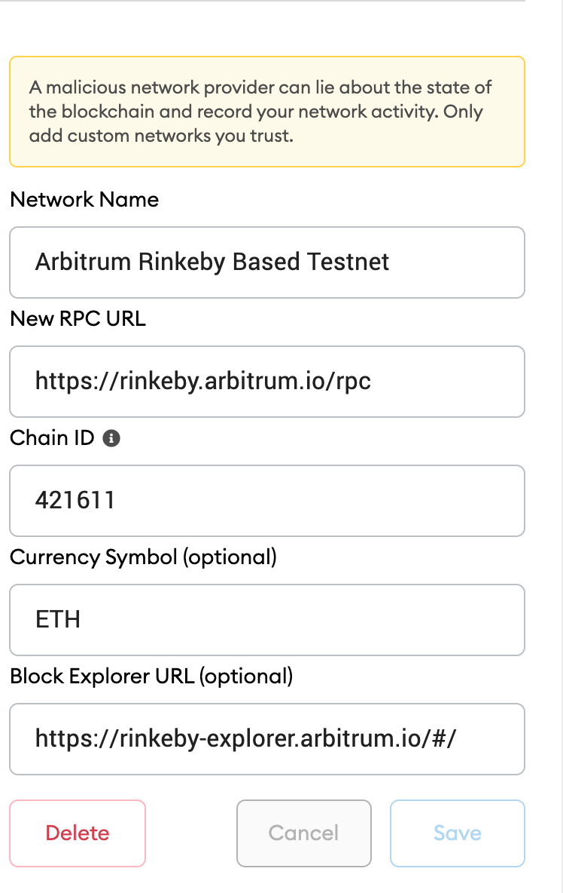

# Create and Deploy ERC20 Token to Arbitrum using Truffle, Web3 Stack

Deploy ERC20 token to Arbitrum using Truffle to Arbitrum Layer2 Testnet only.
Read up on our notes on [Arbitrum ](https://docs.google.com/document/d/14JUtFQvbWLeXYpTcSlvcOMZqLgC-SBqQT90LL_0W3_k/edit?usp=sharing)

Project uses truffle arbitrum box in addition to create-react-app and places build folder in src to demonstrate a full stack app / dapp deployed to an Arbitrum network e.g  Arbitrum Rinkeby and Arbitrum Mainnet  in addition to normal Ethereum network deployments e.g local ganache, testnets kovan etc. The project makes use of the [Truffle Arbitrum Box](https://www.trufflesuite.com/boxes/arbitrum)

To get started! First See below KEY SUMMARY SECTION from original READ.me for info on Arbitrum Box (Ignore ##Installation section on truffle unbox). Below is a summary of key points to compile, run, test, deploy ERC20 to networks Ethereum and Arbitrum

Project makes some slight changes to original truffle box folder structure so as to help see Arbitrum side by side
Ethereum networks on backend and frontend. 

### VERY IMPORTANT!!!!!!

In this example we will deploy ERC20 Token directly to Layer2 Arbitrum without a corresponding pair Token on the L1 
Ethereum related network. This means that at this point it wont be possible to withdraw these tokens on Arbitrum Layer2 to
Layer 1 network. These tokens will only work on Layer2 and is for learning purposes only. 

--------------------------------KEY SUMMARY-----------------------------------------------------------------------

### Machine set up (Optional if you have not setup before or having challenges on your system)

1. Mac & Linux 

- Have python 2.7 installed
Check if installed using command below
```sh
python -V
```
If not installed download from python [Python Download](https://www.python.org/downloads/) version 2.7 related to your system

- Download Ganache Graphical User Interface (GUI ) from [Truffle Framework Site](https://www.trufflesuite.com/ganache) choose related to your system 

- Have node-gyp installed
Check if installed using command below
```sh

```
If not installed, install using command below
```sh
npm i -g node-gyp
```

2. Windows machine 

Ignore Step 7 in the document below (document for bootcamp setup but applies to setup ubuntu environment)

- You may need to [Follow the Windows setup steps in this document](https://www.evernote.com/shard/s584/client/snv?noteGuid=960efc37-4e96-f95a-8c19-cc3b39b54836&noteKey=fd3fd7c99f629eb72a29552f16e4c9e8&sn=https%3A%2F%2Fwww.evernote.com%2Fshard%2Fs584%2Fsh%2F960efc37-4e96-f95a-8c19-cc3b39b54836%2Ffd3fd7c99f629eb72a29552f16e4c9e8&title=B00tc%2540mp%2Bwin10%2Benv.)

### Preconfiguration, Installation and Running project locally 

1. You will need nvm  if not laready installed; so you can use specific version node version 14 and above 
```sh
$ curl -o- https://raw.githubusercontent.com/nvm-sh/nvm/v0.37.2/install.sh | bash
$ source ~/.nvm/nvm.sh
```
Restart your terminal

2. Install node v14.16.0 or versions above
```sh
$ nvm install 14.16.0 
$ nvm alias default 14.16.0 
$ nvm use default
```

3. Install truffle globally if not installed. 
Check if installed using 
```sh
truffle version
```
If not installed install with below 
```sh
$ npm install -g truffle
```

4. Ignore if either installed already! If opting to use ganache-cli vs [Ganache GUI](https://www.trufflesuite.com/ganache), install ganache-cli globally. Note that ganache-cli rus on port 8545 and ganache-gui runs on port 7545 as placced in truffle-config.js. 
Check if ganache-cli installed first with
```sh
ganache-cli --version
```
If not installed install with below
```sh
$ npm install -g ganache-cli
$ ganache-cli
```
Run ganache-cli in different terminal and keep running when compiling,testing, migrating, running app etc

6. Install yarn if not installed. Check if installed using 
```sh
yarn --version
```
If not installed install with below
```sh
$ npm install --global yarn
```

7. Duplicate the .en.example file and rename it .env. Populate your environment variables .env see .env.example 
- Leave the MNEMONIC as is, it works with Local Arbitrum network, replace other variables with correct values from 
Infura and your Metamask Seed phrases. 

8. Configure Metamask networks for Arbitrum Networks
[You can read up on Arbitrum network configuration, bridge and other important contract accounts here](https://github.com/OffchainLabs/arbitrum/blob/master/docs/Public_Testnet.md)

- Arbitrum network to be discuseed here is: Arbitrum Rinkeby. 
You can run Arbitrum Local Node by following truffle box instructions in later part of this READ.me file. 
Caution as testnet and mainnet networks are still in early stages at time of writing this document
You may require your project to be whitelisted first to deploy on Arbitrum Mainnet.

- Setup networks in Metamask, see images below 

<span>
</span>

When you deploy Token to network you can copy its contract address and  Add Asset to Metamask to play around with sending Token between various accounts.

### Migrating contracts and Testing Locally to Local Ethereum using Ganache

1. Compile,test, deploy, migrate Contracts to Etherem networks e.g Local Ganache
Ensure ganache is running in seperate terminal
```sh
ganache-cli
npm run compile:ethereum
npm run test:ethereum
npm run migrate:ethereum
```
2. Run app on localhost front-end
```sh
$ yarn start
```
Enter dApp in browser at localhost:3000

### Migrating contracts and Testing Arbitrum Rinkeby
For now the gasPrice for Arbitrum_Testnet which is Arbitrum_Rinkeby is set at 0 {gasPrice: 0} so there is no 
need to bridge some Rinkeby ETH to Arbitrum ETH for deployment for now. However to bridge some value eg ETH to 
Arbitrum_Rinkey go to [https://bridge.arbitrum.io/](https://bridge.arbitrum.io/), ensure Metamask is on Rinkeby network and 
deposit some funds into Arbitrum_Rinkeby. 

- Setup Infura. If not already added arbitrum network as add-on, got to [infura.io](infura.io) under your account settings
go to Billing. In Billing, Click Manage Add-Ons. Select Arbitrum Rollup and add with your card(there is no charge).

You may have timeouts if so retry.
- Test
```sh
npm run test:arbitrum arbitrum_testnet
```

- Migrate
```sh
npm run migrate:arbitrum arbitrum_testnet
```
[View on Arbitrum Testnet Scan here](https://rinkeby-explorer.arbitrum.io/#/)

- Run app locally 
```sh
yarn start
```
Add as an Asset in Metamask the deployed token copying its address 
from the navbar follow [instructions here to add Asset to Metmask](https://metamask.zendesk.com/hc/en-us/articles/360015489031-How-to-view-see-your-tokens-custom-tokens-in-MetaMask) . Explore sending tokens between accounts on the Arbitrum Rinkeby Based Testnet.

### Migrating contracts to Arbitrum Mainnet 

- Migrate
```sh
npm run migrate:arbitrum arbitrum_mainnet
```

- Run app locally 
```sh
yarn start
```

--------MORE DETAILED INFO _ SEE ORIGINAL TRUFFLE BOX READ.ME BELOW--------------------------------------

- [Requirements](#requirements)
- [Installation](#installation)
- [Setup](#setup)
  * [Using the .env File](#using-the-env-file)
  * [New Configuration File](#new-configuration-file)
  * [New Directory Structure for Artifacts](#new-directory-structure-for-artifacts)
- [Arbitrum](#arbitrum)
  * [Compiling](#compiling)
  * [Migrating](#migrating)
  * [Basic Commands](#basic-commands)
  * [Testing](#testing)
  * [Communication Between Ethereum and Arbitrum Chains](#communication-between-ethereum-and-arbitrum-chains)
- [Support](#support)

<small><i><a href='http://ecotrust-canada.github.io/markdown-toc/'>Table of contents generated with markdown-toc</a></i></small>

This Truffle Arbitrum Box provides you with the boilerplate structure necessary to start coding for Arbitrum's Ethereum Layer 2 solution. For detailed information on how Arbitrum works, please see the documentation [here](https://developer.offchainlabs.com/docs/developer_quickstart).

As a starting point, this box contains only the SimpleStorage Solidity contract. Including minimal code was a conscious decision as this box is meant to provide the initial building blocks needed to get to work on Arbitrum without pushing developers to write any particular sort of application. With this box, you will be able to compile, migrate, and test Solidity code against a variety of Arbitrum test networks.

Arbitrum's Layer 2 solution is almost fully compatible with the EVM. You do not need a separate compiler to compile your Solidity contracts. The main difference between the EVM and the Arbitrum chain that developers will notice is that some opcodes are different and concepts such as time and gas are handled a little differently. Developers can use their regular Solidity compiler to compile contracts for Arbitrum. You can see the complete list of differences between the Arbitrum L2 chain and Ethereum [here](https://developer.offchainlabs.com/docs/differences_overview).

## Requirements

The Arbitrum Box has the following requirements:

- [Node.js](https://nodejs.org/) 10.x or later
- [NPM](https://docs.npmjs.com/cli/) version 5.2 or later
- [docker](https://docs.docker.com/get-docker/), version 19.03.12 or later
- [docker-compose](https://docs.docker.com/compose/install/), version 1.27.3 or later
- Recommended Docker memory allocation of >=8 GB.
- Windows, Linux or MacOS

Helpful, but optional:
- An [Infura](https://infura.io/) account and Project ID
- A [MetaMask](https://metamask.io/) account

## Installation

> Note that this installation command will only work once the box is published (in the interim you can use `truffle unbox https://github.com/truffle-box/arbitrum-box`).

```bash
$ truffle unbox arbitrum
```

## Setup

### Using the env File

ou will need at least one mnemonic to use with the network. The `.dotenv` npm package has been installed for you, and you will need to create a `.env` file for storing your mnemonic and any other needed private information.

The `.env` file is ignored by git in this project, to help protect your private data. In general, it is good security practice to avoid committing information about your private keys to github. The `truffle-config.arbitrum.js` file expects a `MNEMONIC` value to exist in `.env` for running commands on each of these networks, as well as a default `MNEMONIC` for the Arbitrum network we will run locally.

If you are unfamiliar with using `.env` for managing your mnemonics and other keys, the basic steps for doing so are below:

1) Use `touch .env` in the command line to create a `.env` file at the root of your project.
2) Open the `.env` file in your preferred IDE
3) Add the following, filling in your own Infura project key and mnemonics:

```
MNEMONIC="jar deny prosper gasp flush glass core corn alarm treat leg smart"
INFURA_KEY="<Your Infura Project ID>"
RINKEBY_MNEMONIC="<Your Rinkeby Mnemonic>"
MAINNET_MNEMONIC="<Your Arbitrum Mainnet Mnemonic>"
```

_Note: the value for the `MNEMONIC` above is the one you should use, as it is expected within the local arbitrum network we will run in this Truffle Box._

4) As you develop your project, you can put any other sensitive information in this file. You can access it from other files with `require('dotenv').config()` and refer to the variable you need with `process.env['<YOUR_VARIABLE>']`.

### New Configuration File

A new configuration file exists in this project: `truffle-config.arbitrum.js`. This file contains a reference to the new file location of the `contracts_build_directory` and `contracts_directory` for Arbitrum contracts and lists several networks for running the Arbitrum Layer 2 network instance (see [below](#migrating)).

Please note, the classic `truffle-config.js` configuration file is included here as well, because you will eventually want to deploy contracts to Ethereum as well. All normal truffle commands (`truffle compile`, `truffle migrate`, etc.) will use this config file and save built files to `build/ethereum-contracts`. You can save Solidity contracts that you wish to deploy to Ethereum in the `contracts/ethereum` folder.

### New Directory Structure for Artifacts

When you compile or migrate, the resulting `json` files will be at `build/arbitrum-contracts/`. This is to distinguish them from any Ethereum contracts you build, which will live in `build/ethereum-contracts`. As we have included the appropriate `contracts_build_directory` in each configuration file, Truffle will know which set of built files to reference!

## Arbitrum

### Compiling

To compile your Arbitrum contracts, run the following in your terminal:

```
npm run compile:arbitrum
```

This script lets Truffle know to use the `truffle-config.arbitrum.js` configuration file, which tells Truffle where to store your build artifacts. When adding new contracts to compile, you may find some discrepancies and errors, so please remember to keep an eye on [differences between ethereum and Arbitrum](https://developer.offchainlabs.com/docs/differences_overview)!

If you would like to recompile previously compiled contracts, you can manually run this command with `truffle compile --config truffle-config.arbitrum.js` and add the `--all` flag.

### Migrating

To migrate on Arbitrum, run:

```
npm run migrate:arbitrum --network=(arbitrum_local | arbitrum_testnet | arbitrum_mainnet)
```

(remember to choose a network from these options!).

You have several Arbitrum networks to choose from, prepackaged in this box (note: Layer 1 networks are included in the regular `truffle-config.js` file, to aid you with further development. But here we'll just go through the Layer 2 deployment options available):

- `arbitrum_local`: This network is the default Layer 1/Layer 2 integration provided by Arbitrum for testing your Arbitrum-compatible code. Documentation about this setup can be found [here](https://developer.offchainlabs.com/docs/local_blockchain).
  * You will need to install the code for this network in this box in order to use the scripts associated with it. To install it, run `npm run installLocalArbitrum`. You should only need to run this initiation command once. It will create an `arbitrum` directory in this project that will house the repository you need. If at any point you want to update to the latest Arbitrum docker image, you can delete your `arbitrum` directory and run this command again. If you'd rather house the Arbitrum local blockchain outside of this box, see [these notes](https://developer.offchainlabs.com/docs/installation) for how to get started doing so.

  * If you wish to use this network, follow these steps, in this order:

    1) In a new terminal tab, enter `npm run startLocalEthereum`.
    2) Wait for step #1 to complete. The Arbitrum Layer 2 blockchain depends on the existence of a Layer 1 for proper interoperability.
    3) In another new terminal tab, enter `npm run startLocalArbitrum`. Wait a little while, and you will see the Arbitrum blockchain running and interacting with the Layer 1 simulation from step #1! You are ready to try out deploying your contracts!
- `arbitrum_testnet`: Arbitrum has deployed a testnet to the Rinkeby network. The RPC endpoint is https://arbitrum-rinkeby.infura.io/v3/. In order to access this node for testing, you will need to connect a wallet  (we suggest [MetaMask](https://metamask.io/)). Save your seed phrase in a `.env` file as `RINKEBY_MNEMONIC`. Using an `.env` file for the mnemonic is safer practice because it is listed in `.gitignore` and thus will not be committed.
  * Currently, we have the gasPrice for transactions on Arbitrum Rinkeby set to zero. You should be able to use this network as configured at this time.
  * In order to set up your MetaMask wallet to connect to the Arbitrum Rinkeby network, you will need to create a custom RPC network in your wallet. You can find detailed steps for this process [here](https://metamask.zendesk.com/hc/en-us/articles/360043227612-How-to-add-custom-Network-RPC-and-or-Block-Explorer). You will need the following information:
    - RPC Url: `https://arbitrum-rinkeby.infura.io/v3/ + <your infura key>`
    - chain id: 421611

- `arbitrum_mainnet`: This is the mainnet for Arbitrum's Layer 2 solution. You will need to connect your wallet to the Arbitrum mainnet RPC network, located at https://arbitrum-mainnet.infura.io/v3/

Layer 1 networks are included in the `truffle-config.js` file, but it is not necessary to deploy your base contracts to Layer 1 right now. Eventually, you will likely have a Layer 2 contract that you want to connect with a Layer 1 contract. One example is an ERC20 contract that is deployed on an Arbitrum network. At some point the user will wish to withdraw their funds into Ethereum. There will need to be a contract deployed on Layer 1 that can receive the message from Layer 2 to mint the appropriate tokens on Layer 1 for the user. More information on this system can be found [here](https://developer.offchainlabs.com/docs/bridging_assets).

If you would like to migrate previously migrated contracts on the same network, you can run `truffle migrate --config truffle-config.arbitrum.js --network=(arbitrum_local | arbitrum_testnet | arbitrum_mainnet)` and add the `--reset` flag.

## Basic Commands

The code here will allow you to compile, migrate, and test your code against an Arbitrum instance. The following commands can be run (more details on each can be found in the next section):

 To compile:
 ```
 npm run compile:arbitrum
 ```

 To migrate:
 ```
 npm run migrate:arbitrum --network=(arbitrum_local | arbitrum_testnet | arbitrum_mainnet)
 ```

 To test:
 ```
 npm run test:arbitrum --network=(arbitrum_local | arbitrum_testnet | arbitrum_mainnet)
```
### Testing

Currently, this box supports testing via Javascript/TypeScript tests. In order to run the test currently in the boilerplate, use the following command:

```
npm run test:arbitrum --network=(arbitrum_local | arbitrum_testnet | arbitrum_mainnet)
```

Remember that there are some differences between Arbitrum and Ethereum, and refer to the Arbitrum documentation if you run into test failures.

### Communication Between Ethereum and Arbitrum Chains

The information above should allow you to deploy to an Arbitrum Layer 2 chain. This is only the first step! Once you are ready to deploy your own contracts to function on Layer 1 using Layer 2, you will need to be aware of the [ways in which Layer 1 and Layer 2 interact in the Arbitrum ecosystem](https://developer.offchainlabs.com/docs/bridging_assets). Keep an eye out for additional Truffle tooling and examples that elucidate this second step to full Arbitrum integration!

## Support

Support for this box is available via the Truffle community available [here](https://www.trufflesuite.com/community).


I need your confirm about the way to deploy a counterpart ERC20 contract in L2 (actually I followed this process and it works)

### Resources

https://threadreaderapp.com/thread/1395812308451004419.html

https://www.youtube.com/watch?v=NWco7zHDhzk

https://faucet.rinkeby.io/

https://bridge.arbitrum.io/

