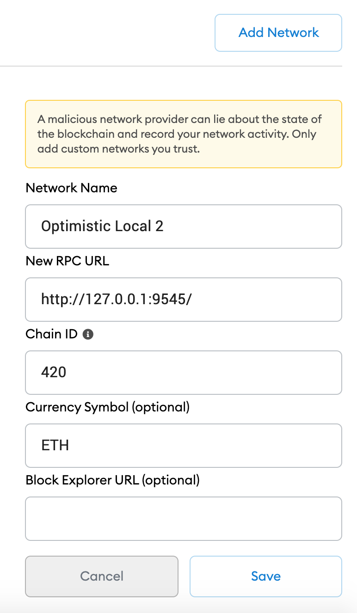
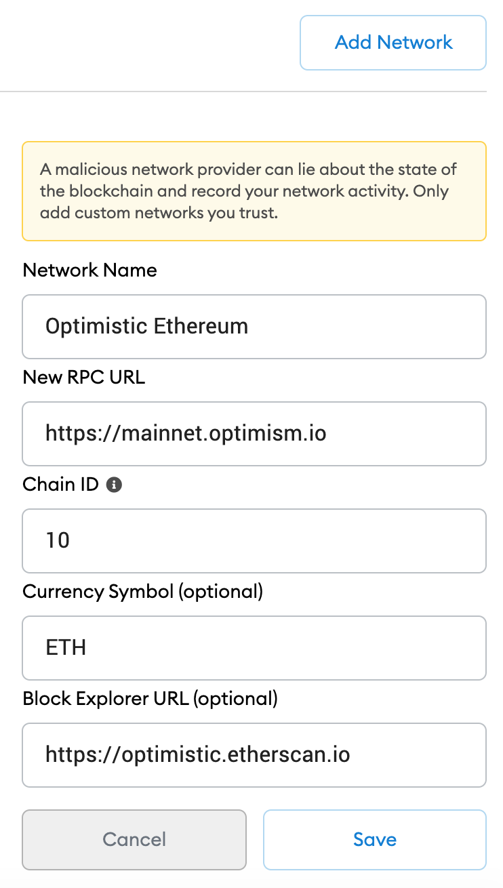

# Simple ERC20 Token deployed to Optimistic Networks 

### About
ERC20 Token deployed to Optimism 
[Read accompanying document on Optimism & Optimistic Rollups](https://docs.google.com/document/d/1qJjz3rzGDKnVjs-qDdwDdGmDdtkLWmMjH4gUqrLP7Is/edit?usp=sharing)  
Stack used is  Hardhat, Ethers,

### Technology Stack and Tools

* [Node Version Manager](https://heynode.com/tutorial/install-nodejs-locally-nvm) - node version manager
* [Optimism](https://optimism.io/) - Optimism Ethereum Scaling solution
* [Docker](https://www.docker.com/) - leading containerization solution
* [ERC721](https://docs.openzeppelin.com/contracts/3.x/erc721) - ERC721 Token standard (NFTs)
* [Metamask Wallet](https://metamask.io/) - Metamask Wallet
* [Hardhat](https://hardhat.org//) - development framework alternative to Truffle 
* [Ethers](https://docs.ethers.io/v5/) - library to interact with Ethereum alternative to Web3.js (supports human readable ABI's)
* [Ethereum-Waffle](https://www.npmjs.com/package/ethereum-waffle) - testing framework for smart contracts
* [React](https://reactjs.org/) - front end framework
* [Solidity](https://docs.soliditylang.org/en/v0.7.4/) - ethereum smart contract language
* [JavaScript](https://www.javascript.com/) - logic front end and testing smart contracts
* [Infura](https://infura.io/) - connection to ethereum networks 
* [Open Zeppelin](https://infura.io/) - smart contract libraries 

##### Folder / Directory Structure (key folders)
* erc20_optimism_hardhhat
  * node_modules
  * public 
    * index.html
  * src
    * backEnd
        * artifacts
        * cache
        * contracts
        * migrations
        * scripts
        * test
    * frontEnd
        * components
        * contractsData
    * index.js
    * .env
    * .env.example
    * hardhat.config.js
    * package.json

### Install packages
1. Enter project directory and install dependancies
```sh
$ yarn install 
```
### Running project locally (Layer1 setups) 
- just to check all is okay and contracts can be deployed, tested, migrated
1. Run local blockchain with hardhat and keep running in seperate terminal
```sh
npx hardhat node
```
2. To compile contracts e.g you make changes to contracts 
```sh
$ npx hardhat compile --network hardhat
```
3. To test contracts 
```sh
$ npx hardhat test --network hardhat
```
4. Deploy contracts
```sh
$ npx hardhat run src/backEnd/scripts/deploy.js --network hardhat
$
```

### Deploying to Optimism networks

[You can also lookup with Optimism Developer documentation here](https://community.optimism.io/docs/) or
reference with [Github repository](https://github.com/ethereum-optimism/optimism-tutorial)
'@eth-optimism/hardhat-ovm' is the package that brings OVM compiler support to Hardhat projects.

3 Optimism networks to be discuseed here are: local Optimism node, Optimistic Kovan(optimism-kovan) and Optimistic Ethereum(optimism-ethereum). Caution as testnet and mainnet networks are still in early stagesa at time of writing this document.

- Setup networks in Metamask, see images below 

<span>
</span>

- Setup your .env file. 

Duplicate .env.example and rename to .env Copy your Metamask Mnemonic Seed Phrase and replace 
the one in your .env file with the copied mnemonic

- Fund accounts using a  bridge from Kovan ETH to Optimistic Kovan and from Ethereum Mainnet to Optimistic Ethereum. Get Kovan testnet ETH into a Metamask account e.g use faucets like https://gitter.im/kovan-testnet/faucet or https://enjin.io/software/kovan-faucet or https://linkfaucet.protofire.io/kovan
Ensure Metamask is setup correctly for Optimistic Kovan Network and Optimitic Ethereum Networks see earlier section [or read here](https://community.optimism.io/docs/developers/metamask.html#connecting-manually)
[Bridge Kovan ETH to Optimistic Kovan ETH here](https://gateway.optimism.io/). Caution!!! When using mainnet bridign you are using your real funds from Ethereum mainnet to Optimism using the bridge. 

- If you switch between networks in Metamask you will have to redeploy to the network you swtiched to first. 


## 1 => Deploy to Layer 2  Optimism LocalNode 
Copy and import the first addresses private key from Docker running Local Optimistic Node

1. Ensure you have Docker installed on your machine use this link [https://docs.docker.com/get-docker/](https://docs.docker.com/get-docker/)
Check installaton using commands below
``sh
docker --version
docker-compose --version
``

2. Run Local Optimistic Ethereum Node
Run and keep running a local Optimistic Ethereum node using Docker 
```sh
git clone https://github.com/ethereum-optimism/optimism.git
cd optimism
yarn install
yarn build
cd ops
docker-compose build
docker-compose up
```

3. Test on local Optimistic Ethereum Node
```sh
npx hardhat test --network optimistic_local
```

4. Deploy Optimistic Ethereum Contract to local Optimism
```sh
npx hardhat run src/backEnd/scripts/deploy.js --network optimistic_local
```

5. Run app on localhost front-end and interact with app
```sh
$ npm start
```
Add Token as an Asset in Metamask the deployed token copying its address e.g
from the navbar follow [instructions here](https://metamask.zendesk.com/hc/en-us/articles/360015489031-How-to-view-see-your-tokens-custom-tokens-in-MetaMask)
Use Decimal = 1 when setting deployed Token for this example Token

## 2 => Deploy to Layer 2 testnet Optimism Kovan 

1. Deploy Optimistic Ethereum Contract to local Optimism
```sh
npx hardhat run src/backEnd/scripts/deploy.js --network optimistic_kovan
```

2. Run app on localhost front-end and interact with app
```sh
$ npm start
```
Add Token as an Asset in Metamask the deployed token copying its address e.g
from the navbar follow [instructions here](https://metamask.zendesk.com/hc/en-us/articles/360015489031-How-to-view-see-your-tokens-custom-tokens-in-MetaMask)
Use Decimal = 1 when setting deployed Token for this example Token

## 3 => Deploy to Layer 2 mainnet Optimism Ethereum 

Caution!! You may need to use some real Ethereum to do deployment. See previous section on using bridge.

1. Deploy Optimistic Ethereum Contract to local Optimism
```sh
npx hardhat run src/backEnd/scripts/deploy.js --network optimistic_ethereum
```

2. Run app on localhost front-end and interact with app
```sh
$ npm start
```
Add Token as an Asset in Metamask the deployed token copying its address e.g
from the navbar follow [instructions here](https://metamask.zendesk.com/hc/en-us/articles/360015489031-How-to-view-see-your-tokens-custom-tokens-in-MetaMask)
Use Decimal = 1 when setting deployed Token for this example Token
